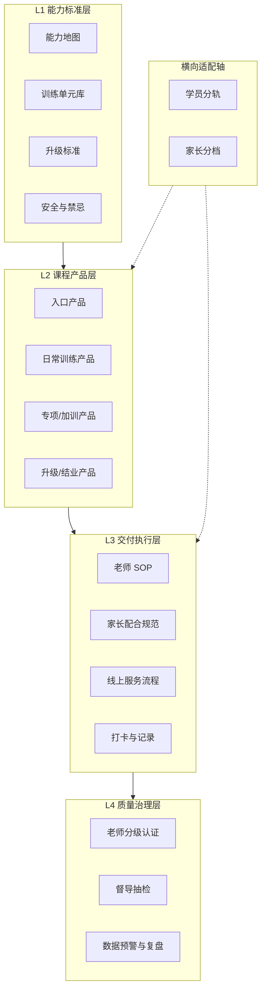

# 脑能力与学习能力训练体系 · 框架结构（V0.2）

<!-- canonical-banner -->
> **文档角色**：`unique`　**主题**：交付框架标准
> **参见**：训练方法/九段 → `training/methods.md`
> **说明**：交付体系框架，与 methods 分工不同
<!-- /canonical-banner -->
> **文档状态**：讨论稿 · 已对齐护航交付实操
> **版本**：V0.2（2026-08-28）
> **用途**：与同事沟通讨论训练体系整体架构，后续逐模块填充内容、形成可执行方案
> **V0.2 变更**：并入《护航交付标准化》《交付团队管理升级》纪要——六步交付、SLA、留痕闭环、通关考核、值班答疑等；详见 [delivery-escort-sop.md](delivery-escort-sop.md)

---

## 目录

- [一、体系定位与边界](#一体系定位与边界)
- [二、体系总架构](#二体系总架构)
- [三、L1 能力标准层](#三l1-能力标准层)
- [四、L2 课程产品层](#四l2-课程产品层)
- [五、L3 交付执行层](#五l3-交付执行层)
- [六、L4 质量治理层](#六l4-质量治理层)
- [七、内容资产目录](#七内容资产目录)
- [八、落地路线图](#八落地路线图)
- [九、待补充内容清单](#九待补充内容清单)
- [十、讨论议题（明日会议参考）](#十讨论议题明日会议参考)
- [附录：内容投喂模板](#附录内容投喂模板)

---

## 一、体系定位与边界

### 1.1 体系要解决的核心问题

| 问题              | 体系回应                     |
| --------------- | ------------------------ |
| 老师水平参差，服务不一致    | 统一「训练单元 + 执行 SOP + 验收标准」；护航**通关考核**后上岗 |
| 学员差异大（年龄、天赋、基础） | 「标准骨架 + 分轨适配」，而非一人一方案    |
| 家长配合度不一         | 家长角色最小化、分级配合；强调**陪伴认知**而非只盯孩子 |
| 效果难证明、难复制       | 过程验收 + 能力验收 + 迁移验收；**三点总结 + 满意闭环**留痕 |
| 内容散落在个人经验里      | 内容资产化、可检索、可版本管理；统一交付资料库 |
| 服务「像机器人」、满意度低   | 温度标准 + 语音优先 + 值班答疑；满意度目标约 30%→60% |

### 1.2 体系边界（先写清楚「不是什么」）

- **是**：能力训练的方法论、标准流程、验收体系、老师赋能体系
- **不是**：学科补课内容库、应试技巧大全、纯销售话术库
- **关系**：提分 / 学业表现作为**迁移验收**的结果指标之一，而非唯一目标

### 1.3 设计原则（7 条）

1. **统一骨架，差异填充** — 流程、时长、验收统一；材料、难度、激励方式可适配
2. **可执行优先于可理解** — 老师能「照着做」，比「理解原理」更重要（原理放培训层）
3. **验收驱动** — 每个训练动作必须对应可观察、可记录的结果
4. **分层托底** — 系统 / SOP 托住下限，优秀老师提升上限（管理追底线，不只追最高）
5. **模块化迭代** — 先 3 项核心能力跑通，再扩展，不追求一次做全
6. **分步闭环，反堆砌** — 先教一项 → 实践 → 反馈 → 再教下一项；禁止一次群发二十条资料
7. **高薪必须可量化** — 有效交付、节点抽查、满意度闭环可查，才配得上激励

---

## 二、体系总架构

### 2.1 四层结构

```
┌─────────────────────────────────────────────────────────┐
│  L4 质量治理层                                           │
│  老师分级认证 · 督导抽检 · 数据预警与复盘                  │
├─────────────────────────────────────────────────────────┤
│  L3 交付执行层                                           │
│  老师 SOP · 家长配合规范 · 线上服务流程 · 打卡与记录        │
├─────────────────────────────────────────────────────────┤
│  L2 课程产品层                                           │
│  入口产品 · 日常训练产品 · 专项/加训产品 · 升级/结业产品    │
├─────────────────────────────────────────────────────────┤
│  L1 能力标准层                                           │
│  能力地图 · 训练单元库 · 升级标准 · 安全与禁忌              │
└─────────────────────────────────────────────────────────┘
```

**依赖关系**：L1 → L2 → L3 → L4（自下而上构建，自上而下执行）

### 2.2 两轴适配

| 轴         | 说明                                  |
| --------- | ----------------------------------- |
| **纵向进度轴** | 学员在能力体系中的阶段（入门 → 基础 → 进阶 → 综合 → 应用） |
| **横向适配轴** | 按学员特征、家庭特征做「同结构、不同参数」的调整            |

### 2.3 架构关系图



---

## 三、L1 能力标准层

> 体系的「宪法」。后续补充的核心知识，大部分应落在此层。

### 3.1 能力地图（总纲）

建议按「输入 → 输出 → 综合 → 应用」四层组织（名称可后续替换为体系用语）：

```
L1 基础层    │ 例：专注力、感知、阅读输入 …          【待填充】
L2 进阶层    │ 例：记忆输入、记忆调取、运算调取 …      【待填充】
L3 综合层    │ 例：快速学习（存+取合体）…            【待填充】
L4 应用层    │ 例：学科迁移、外语、决策、导读 …        【待填充】
```

### 3.2 每项能力的「四张标准卡」

| 卡片      | 内容                | 状态  |
| ------- | ----------------- | --- |
| **定义卡** | 解决什么问题；对应哪些学习坏习惯  | 待填充 |
| **动作卡** | 标准步骤、时长、材料、频次、禁忌  | 待填充 |
| **验收卡** | 基线测量方法、达标线、升级条件   | 待填充 |
| **适配卡** | 不同年龄段 / 类型的参数调整规则 | 待填充 |

### 3.3 训练单元库（最小可复制单元）

**训练单元** = 体系的原子单位。一次训练服务至少对应 1 个单元。

#### 单元标准结构模板

```
[单元编号]                    ← 编号规则待定
├── 所属能力
├── 适用对象（学段 / 类型 / 服务形态）
├── 训练目标（可量化，1 句）
├── 标准流程（准备 → 主练 → 迁移 → 验收，含分钟分配）
├── 动作清单（逐步操作，含禁忌）
├── 验收表（指标 + 分值 + 达标线）
├── 配套资源（音频 / 材料 / 工具）
├── 话术要点（对学员 / 对家长，各 3–5 条）
└── 常见问题与纠偏
```

#### 编号规则建议（讨论用）

| 字段   | 示例         | 说明        |
| ---- | ---------- | --------- |
| 能力缩写 | FCS        | 专注力 Focus |
| 周次   | W02        | 第 2 周     |
| 难度   | L1         | Level 1   |
| 完整编号 | FCS-W02-L1 | 便于检索与排课   |

### 3.4 升级标准（纵向进度）

定义学员在体系中的**阶段节点**，每个节点需明确：

- [ ] 前置能力要求
- [ ] 测评 / 验收方式
- [ ] 达标后可解锁的训练内容
- [ ] 未达标时的回退 / 加练规则

> 若有「九段」或类似分级，可整体映射到此结构，名称后续再定。

### 3.5 安全与禁忌（红线库）

单独成库，强制写入所有 SOP：

- [ ] 单项能力训练上限
- [ ] 不可单独无限训练的能力
- [ ] 特殊类型学员的监控项
- [ ] 家长 / 老师禁止行为

---

## 四、L2 课程产品层

> 产品 = 训练单元的**组合 + 节奏 + 服务承诺**，不是新的训练内容。

### 4.1 产品矩阵（框架）

| 产品类型        | 定位           | 典型周期            | 核心结构            |
| ----------- | ------------ | --------------- | --------------- |
| **入口产品**    | 新学员进入体系、建立基线 | 如 7–14 天        | 测评 + 密集训练 + 强验收 |
| **日常产品**    | 走读 / 可持续训练   | 长期，每日 30–60 min | 周主题轮换 + 日单元     |
| **波浪产品**    | 住校 / 难日常坚持   | 集训 + 回训         | 台阶式 + 防回落       |
| **加训产品**    | 急需求（如升学）     | 按天 / 按小时        | 能力→学科迁移优先       |
| **专项产品**    | 单一能力或场景      | 4–12 周          | 单能力深度 + 迁移      |
| **升级/结业产品** | 阶段认证         | 节点触发            | 综合测评 + 授勋/仪式    |

> 各产品具体名称、价格、服务承诺：**待填充**（可参考 [products.md](../frontline/products.md)）

### 4.2 每个产品的标准定义模板

```
[产品名称]
├── 适用对象（谁适合 / 谁不适合）
├── 服务承诺（时长、频次、交付形式）
├── 训练节奏（日/周/阶段安排）
├── 包含的训练单元清单（按周排列）
├── 验收节点（第几天/第几周验什么）
├── 所需角色（老师级别、是否需督导）
├── 家长配合要求（配合档位）
└── 退出/升级路径（完成后去哪）
```

### 4.3 学员分轨（横向适配 · 学员侧）

同一产品内，用**分轨**而非「自由定制」：

| 分轨维度    | 作用                      | 影响什么          |
| ------- | ----------------------- | ------------- |
| **学段轨** | 幼儿园 / 小学 / 初中 / 高中 / 大学 | 迁移任务难度、材料选择   |
| **基础轨** | 新入 / 有基础 / 进阶           | 单元难度、进度快慢     |
| **类型轨** | 五者天赋（思/赢/德/行/学） | 激励方式、音频/资源、话术 |
| **形态轨** | 走读 / 住校 / 急训            | 产品节奏、回训安排     |

### 4.4 家长分档（横向适配 · 家庭侧）

| 配合档        | 特征           | 家长最小动作    | 老师补偿     |
| ---------- | ------------ | --------- | -------- |
| **A 高配合**  | 有时间、愿学习      | 完整验收 + 反馈 | 正常流程     |
| **B 一般配合** | 有时间、不懂方法     | 看视频照做 3 步 | 老师多引导    |
| **C 低配合**  | 忙 / 不理解 / 抵触 | 仅打卡或录音上传  | 老师远程验收为主 |

> 原则：家长不需要懂方法论，只需要完成**可观察的动作**。

---

## 五、L3 交付执行层

> 让不同水平的老师，能稳定交付相近质量的服务。
> **实操细则全文**：[delivery-escort-sop.md](delivery-escort-sop.md)

### 5.1 两类交付场景

| 场景 | 说明 | 主节奏 |
|------|------|--------|
| **A. 单次训练服务** | 直播课 / 一对一陪练 / 集训课 | 约 45 分钟五阶段结构 |
| **B. 护航跟进服务** | 新导师 / 年度会员护航（企业微信） | **六步节点 A–F**，30–60 天闭环 |

二者共用同一套能力标准（L1），但动作清单不同。

### 5.2 标准线上训练课流程（场景 A）

**单次服务标准结构（时长可调整，结构不变）：**

| 阶段  | 名称    | 内容               | 建议时长   |
| --- | ----- | ---------------- | ------ |
| 1   | 开场启动  | 目标确认、状态检查、今日单元说明 | 5 min  |
| 2   | 主能力训练 | 准备 → 练习 → 冲刺/PK  | 20 min |
| 3   | 迁移应用  | 对接当天学习 / 生活场景    | 10 min |
| 4   | 验收记录  | 打分、填写、基线对比       | 5 min  |
| 5   | 收尾沟通  | 家长 3 句话反馈、明日预告   | 5 min  |

**合计约 45 分钟**（可根据产品类型调整，但五阶段结构不变）

主能力训练子流程：

```
准备（2 min）→ 练习（14 min）→ 冲刺 PK（4 min）
```

### 5.3 护航六步交付（场景 B · 已对齐业务）

| 节点 | 时间窗 | 重点 |
|------|--------|------|
| A | 当日建联 | 10–20 分钟内海报+自我介绍；首通；定 7 天目标 |
| B | 第 7 天 | 首周复盘、卡点、打卡固化 |
| C | 第 8–13 天 | 能力推进、家长陪伴认知 |
| D | 约第 14 天 | 深度沟通、调方案 |
| E | 约第 21 天 | 阶段验收 |
| F | 约第 30 天 | 六步闭环＝一次「有效交付」 |

内容主线：家长陪伴认知 → 九段技术掌握 → 日常坚持 → 节点深度沟通。
推进铁律：**一项一项教**，禁止资料堆砌。前 7 天为启动期（电话、基础课、音频方案、打卡指导、未打卡即电联）。

### 5.4 响应 SLA 与服务温度

| 场景 | 标准 |
|------|------|
| 新客建联 | 10–20 分钟内首响 |
| 老客提问 | 半小时内必响（可先「稍后回」） |
| 监察时段 | 每天 9:30–22:30 |
| 温度 | 语音优先；有问候；禁机器人感；节日禁只会催练 |

### 5.5 老师 SOP 体系

| 文档类型       | 用途              | 状态  |
| ---------- | --------------- | --- |
| **护航交付 SOP** | 六步节点 + SLA + 留痕 | ✅ [delivery-escort-sop.md](delivery-escort-sop.md) |
| **执行 SOP** | 分钟级训练课操作清单 | 待按单元细化 |
| **话术库**    | 百问百答 + 关怀语料 + 天赋应用话术 | 建设中 |
| **纠偏手册**   | 孩子卡点 / 家长卡点 | 通关考核必考 |
| **禁忌清单**   | 堆砌资料、删客户记录、超时不响应等 | 见交付 SOP |
| **应急处理**   | 未打卡、投诉、升级为店铺客户移交 | 见交付 SOP |

### 5.6 记录与打卡规范

#### （1）训练课最小数据集

| 字段    | 说明           |
| ----- | ------------ |
| 日期    | 服务日期         |
| 单元编号  | 如 FCS-W02-L1 |
| 执行老师  | 老师 ID / 姓名   |
| 主能力分  | 占 60%        |
| 迁移分   | 占 30%        |
| 专注分   | 占 10%        |
| 观察记录  | 1 句话         |
| 是否达标  | 是 / 否        |
| 是否需加练 | 是 / 否        |

```
今日得分 = 主能力分（60%）+ 迁移分（30%）+ 专注分（10%）
```

#### （2）护航跟进留痕（业务强制）

两大表：**总部护航数据跟进表** + **交付老师日报表**。

每次沟通三点总结并请客户回复满意度：

```
1. 我解决了什么问题：
2. 提供了什么方案：
3. 请您回复是否满意：
```

满意闭环后截图（含时间戳）上传；企微标签：来源 / 孩子属性 / 家长属性 / 期数。

---

## 六、L4 质量治理层

> 保证标准不走样，让体系依赖「流程」而非「能人」。
> 「团队任何人干得不好都是管理者的事」——负面体验默认先自查体系与辅导。

### 6.1 老师分级与认证

| 级别     | 能力范围      | 认证要求（框架）     |
| ------ | --------- | ------------ |
| **实习** | 带练、跟课     | 理论 + SOP 演示  |
| **认证 / 通关** | 独立护航或带标准单元 | **护航通关考核**：练法 + 孩子卡点 + 家长卡点 + 话术框架；或模拟课≥85 |
| **督导** | 带教、抽检、诊断  | 听前 3–5 通关键电话质检；案例复盘 |
| **专家** | 复杂学员、教研迭代 | 综合测评 + 教学研究院贡献 |

### 6.2 入职 / 通关训练（框架）

| 天数 / 模块 | 内容                   |
| ----- | -------------------- |
| D1–D2 | 理论底线：学习本质、五者、安全禁忌  |
| D3–D4 | 九段能力 SOP 过关（演示 + 被评） |
| D5    | 模拟课 / 模拟首通电话（录音质检）   |
| D6    | 系统工具：智能表、企微标签、日报、跟进表 |
| D7    | 真实客户跟班（督导旁听）     |
| 持续 | 百问百答补充；早课案例反哺教研 |

### 6.3 质量机制

| 机制   | 频率             | 目的           |
| ---- | -------------- | ------------ |
| 通关考核 | 上岗前 | 统一练法与话术本质 |
| 节点抽查 | 六步 A–F 抽检（非全量形式主义） | 有效交付可核实 |
| 通话质检 | 每人前 3–5 通关键电话必听 | 温度与专业度 |
| 新课抽检 | 新老师前 20 课 100% | 防早期跑偏        |
| 随机抽检 | 10–20%         | 维持平均水平       |
| 数据预警 | 实时             | 连续未达标、打卡中断   |
| 周复盘  | 每周             | 好课分享 + 问题课纠偏 |
| 阶段审计 | 每产品节点          | 升级是否合规       |

### 6.4 验收体系（能力 + 交付）

| 级别 | 谁验收 | 验什么 | 频率 |
|------|--------|--------|------|
| **L0 过程** | 老师 / 家长 | 打卡、动作完成度；护航三点总结是否闭环 | 每天 |
| **L1 能力** | 老师 | 周目标 / 九段指标是否达标 | 每周 |
| **L1b 节点** | 督导 | 六步 A–F 是否按时、截图是否可查 | 按节点 |
| **L2 迁移** | 督导 / 系统 | 课堂 / 作业真实表现；家长陪伴是否建立 | 每 2–4 周 |
| **L3 结果** | 公司 | 有效交付数、满意度、升级 / 续费 / 投诉 | 阶段节点 |

另设 **每日值班答疑**（标准统一后）：纯训练卡点解答，建议晚 9:30 后，与家长课堂区分。

### 6.5 数据看板（框架指标）

**学员 / 家长侧：**

- 打卡率、未打卡跟进率
- 周达标率、能力基线变化
- 迁移完成率
- **满意度闭环率**（三点总结 → 客户回复）

**老师侧：**

- 响应时效合规率（10–20 分钟 / 半小时）
- 六步有效交付数
- 执行合规率、抽检得分
- 通话质检通过率

**产品 / 经营侧：**

- 各产品完成率、升级率
- 投诉 / 退费关联
- 单老师群容量（参考 60–70）

---

## 七、内容资产目录

后续知识按以下目录归档，避免散落：

```
训练体系知识库/
├── 01-理论与原则/          # theory.md
├── 02-能力标准/            # talents + training 能力卡
├── 03-训练单元库/          # 可执行最小单元 ★
├── 04-产品包/              # 火箭营 / 日常 / 专项
├── 05-交付SOP/
│   ├── 护航六步与 SLA      # delivery-escort-sop.md ✅
│   ├── 标准线上课流程
│   ├── 百问百答 / 话术库
│   └── 纠偏与应急（双线卡点）
├── 06-家长手册/            # 陪伴认知、分档配合
├── 07-老师培训/            # 通关考核、分级
├── 08-测评与升级/          # 九段晋级、基线工具
├── 09-案例库/              # 好课 / 好电话录音
└── 10-教研资料库/          # 按学段×天赋×学科分类推送
```

**优先级标注：**

- ★★★★★ 训练单元库、护航 SOP、通关考核、百问百答
- ★★★★ 家长操作视频、值班答疑、智能表节点预警
- ★★★ 案例库、教学研究院课题
---

## 八、落地路线图

| 阶段                       | 目标                   | 主要产出                                 | 验证标准              |
| ------------------------ | -------------------- | ------------------------------------ | ----------------- |
| **Phase 1：骨架验证**（1–2 月）  | 证明「同一单元，不同老师能教出相近结果」 | 3 项核心能力 × 完整单元；1 条产品路径；1 套 45min SOP | 5–10 名老师、20+ 学员跑通 |
| **Phase 2：矩阵扩展**（2–4 月）  | 覆盖主要分轨               | 各类型/学段精简包；老师认证；家长分档手册                | 新人 7 天可独立带课       |
| **Phase 3：系统规模化**（4–6 月） | 降低对人依赖               | 单元库 100+；排课/打卡/预警系统                  | 督导成本可控、质量波动缩小     |

### Phase 1 优先事项（建议确认）

- [x] 护航六步 + SLA + 留痕闭环写入体系（见 delivery-escort-sop）
- [ ] 通关考核题库定稿并开考
- [ ] 确定首批 3 项核心能力完整训练单元（建议：超脑阅读、影像追忆、扫描速记）
- [ ] 百问百答 + 值班答疑试点
- [ ] 智能表六步节点预警全员启用
- [ ] 指定种子护航老师做「有效交付」示范周

---

## 九、待补充内容清单

| 优先级 | 待补充内容 | 填入框架位置 | 状态 |
| ------ | --------------- | ------------ | --- |
| **P0** | 完整能力清单与层级关系 | L1 能力地图 | ✅ 见 training / theory |
| **P0** | 学员分类体系（五者） | 横向适配轴 | ✅ 见 talents |
| **P0** | 3–5 项最核心能力完整单元卡 | L1 训练单元库 | 进行中 |
| **P0** | 护航通关考核正式卷 | L4 | 待出题 |
| **P1** | 现有产品名称、周期、服务承诺 | L2 产品矩阵 | 部分见 products |
| **P1** | 九段晋级运营表 | L1 升级标准 | ✅ 见 training |
| **P1** | 安全禁忌与特殊学员注意项 | L1 红线库 | 部分见 theory |
| **P1** | 孩子/家长卡点手册 | L3 纠偏 | 待整理 |
| **P2** | 音频 / 工具 / 资源体系 | 单元配套资源 | 待补充 |
| **P2** | 百问百答全量入库 | L3 话术 | 建设中 |
| **P2** | 教学研究院课题清单 | 教研 | 方向已定 |

---

## 十、讨论议题（明日会议参考）

### 议题 1：框架四层结构是否认可？

- L1 能力标准 → L2 课程产品 → L3 交付执行 → L4 质量治理
- 「统一骨架 + 分轨适配」是否符合业务实际？
- 有无遗漏的关键模块？

### 议题 2：首批试点范围

- 选哪 3 项核心能力先做完整单元？
- 选哪条产品路径先跑通？（入口 / 日常 / 其他）
- 选哪个学员类型 × 学段做首个分轨？

### 议题 3：老师与服务形态

- 线上单次服务标准时长：45 min 是否合适？
- 老师分级（实习 / 认证 / 督导 / 专家）是否与现有体系对齐？
- 入职 7 天训练营是否可执行？

### 议题 4：家长角色边界

- 三档配合（高 / 一般 / 低）是否覆盖主要家庭类型？
- 家长最小动作是否可以再简化？

### 议题 5：验收与数据

- 三级验收（过程 / 能力 / 迁移）是否足够？
- 最小数据集字段是否需要增减？
- 打卡工具选型？

### 议题 6：内容与分工

- P0 待补充内容谁负责、什么时间给到？
- Phase 1 种子老师与试点学员如何选取？
- 下次评审会议时间？

---

## 附录：内容投喂模板

后续补充知识时，可按以下格式提供，便于对位填入框架。

### 能力模板

```markdown
## 【能力名】

- **定义**：
- **类型**：输入 / 输出 / 综合 / 应用
- **解决什么问题**：
- **对应学习坏习惯**：
- **标准动作**（步骤 + 时长）：
  1.
  2.
  3.
- **验收指标**：
  - 基线测量方法：
  - 达标线：
  - 升级条件：
- **适配规则**：
  - 幼儿园：
  - 小学：
  - 初中及以上：
- **禁忌**：
- **配套资源**：
```

### 产品模板

```markdown
## 【产品名】

- **定位**：
- **周期与服务承诺**：
- **适用对象**（适合 / 不适合）：
- **每天/每周做什么**：
- **包含的训练单元**（按周）：
- **验收节点**：
- **家长配合要求**：
- **完成后路径**：
```

### 训练单元模板

```markdown
## 【单元编号】如 FCS-W02-L1

- **所属能力**：
- **适用对象**：
- **训练目标**（1 句、可量化）：
- **标准流程**：
  - 准备（_min）：
  - 主练（_min）：
  - 迁移（_min）：
  - 验收（_min）：
- **动作清单**：
- **验收表**：
- **话术要点**：
- **常见问题**：
```

---

## 版本记录

| 版本   | 日期         | 变更说明       |
| ---- | ---------- | ---------- |
| V0.1 | 2026-08-27 | 初版框架，供团队讨论 |
| V0.2 | 2026-08-28 | 并入护航交付两纪要：六步交付、SLA、留痕、通关、值班答疑；L3/L4 实操化 |

---

## 相关文档

- [护航交付标准化（实操版）](delivery-escort-sop.md) ← **交付动作首选**
- [训练能力体系](../training/methods.md)
- [五者天赋体系](../foundations/talents.md)
- [五者天赋应用](../practice/talents-application.md)
- [产品线与商业体系](../frontline/products.md)
- [核心理论与教学方法论](../foundations/theory.md)
- [10 岁赢者女孩 12 周细化训练方案](../training/examples/training-plan-winner-girl-10yo.md)（训练单元范例）
