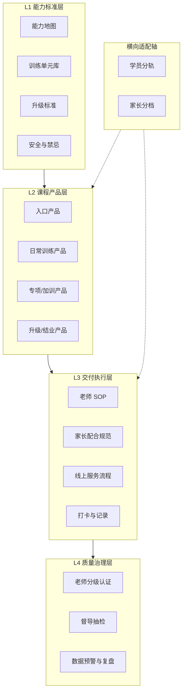

[脑科学教育 · L4 delivery · training-system-framework.md · 2.2 两轴适配]

### 2.2 两轴适配
| 轴         | 说明                                  |
| --------- | ----------------------------------- |
| **纵向进度轴** | 学员在能力体系中的阶段（入门 → 基础 → 进阶 → 综合 → 应用） |
| **横向适配轴** | 按学员特征、家庭特征做「同结构、不同参数」的调整            |
### 2.3 架构关系图

---
