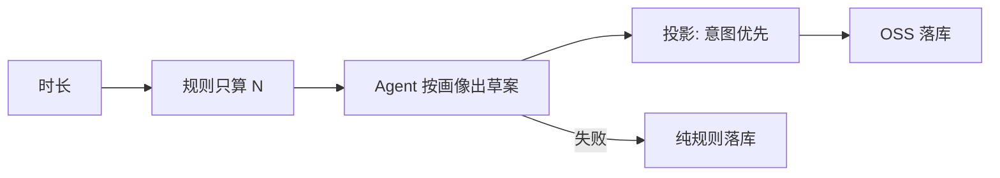

# 今日训练排课 Agent 规则说明

> 日期：2026-08-10（标准解耦修订）  
> 范围：`backend/app/agents/training_schedule/*`、`services/training_agent_assist.py`、`services/training_schedule_service.py`、训练页「智能排课」  
> 立场：**B 方向 — Agent 按画像定意图；规则引擎只做槽位预算闸门 + 合法落库 + 失败兜底**  
> 相关：`docs/今日训练Agent辅助排课升级需求报告-2026-07-31.md`、`docs/权重排课方案.md`、`docs/体系架构设计.md` §7、`backend/app/agents/README.md`

---

## 1. 一句话

用户点「智能排课」时：

1. **规则引擎**只算出今日必修项数预算 **N**（及内部 `rule_slots`，**不对模型展示名单**）。  
2. **Agent** 只看课表边界 + 用户画像，自主给出 `skills` 顺序 + `reason`（可重复弱项）。  
3. **投影层**意图优先补齐到 N；仍不足才用规则名单垫底。  
4. 与规则路径同一套 OSS 落库。失败 → `agent_fallback`。

「开始训练」默认仍走纯规则（`schedule_prefer=rule`）。

**规则 = 闸门，不是思考范文。** 禁止把 `expand_formula` 的技能列表注入 LLM。

---

## 2. 职责边界（硬规则）

| 允许 | 禁止 |
|------|------|
| 按画像推荐必修顺序（可重复） | 向 LLM 注入完整 `rule_slots` / 标准方案名单 |
| 写中文 `reason`（DEV 可见） | 直接写 DB / 改 Tier / OSS / 代打卡 |
| 只读工具补查课表/打卡/节奏 | import Guide / QA runner |
| 失败回退规则引擎 | 把 locked / 选修写进必修草案强行落库 |
| 选修槽跟规则尾巴 | 向用户/模型解释晋级公式 |

落库入口：`populate_plan_items`（可 `slots_override`）。

---

## 3. 流水线

```text
选时长 + schedule_prefer=agent
  → expand_formula → N + rule_slots（仅服务层保留）
  → run_schedule_assist
       首轮注入：课表 + 画像 + slot_budget（软）——不含规则技能名单
       → propose_skill_draft(skills, reason)
  → validate_and_project（意图优先补齐 → 规则垫底）
  → populate_plan_items(slots_override=…)
  → schedule_assist_json（含 draft / rule_slots 对照 / projected）
```



---

## 4. 人设要点（`persona.py`）

1. 按画像自主排序，**勿抄标准/规则方案名单**。  
2. 只能写 `selectable_now`；locked 仅理解。  
3. struggling 宜巩固（可靠前或重复）；stable 可后置。  
4. `slot_budget` 为软预算，可略少/略多。  
5. 必须 `propose_skill_draft(skills, reason)`。

---

## 5. 用户画像切片

| 层 | 字段 | 随使用 |
|----|------|--------|
| 底盘 | talent、grade_band | 测评后稳 |
| 进度 | overall_tier、skill_tiers、training_days | 晋级后变 |
| 行为 | struggling / stable、达标率等 | 打卡越厚越准 |
| 节奏 | 连打、断档、完成比例 | 习惯成型后稳 |
| 课表边界 | selectable / key·secondary / locked | 随 Tier 变 |
| 软预算 | slot_budget ≈ N | 每次时长给定 |

未接入：Guide 记忆、测评长文、家长备注、晋级内部计数。

---

## 6. 工具

| 工具 | 作用 |
|------|------|
| `get_curriculum_overview` | 全课表 / 各阶重点 |
| `get_available_skills` | selectable + 重要性 + locked |
| `get_schedule_context` | 画像上下文 + `slot_budget` |
| `get_recent_training_history` | 近史技能 |
| `get_checkin_skill_summary` | 打卡质量 |
| `get_training_rhythm` | 连打/断档 |
| `get_slot_budget_hint` | 软预算（**非规则名单**） |
| `propose_skill_draft` | 提交 skills + reason |

`get_rule_slot_hint` 仍注册为兼容别名，语义等同软预算；**OpenAI schema 只暴露** `get_slot_budget_hint`。

---

## 7. 投影（意图优先）

1. 丢掉非法 / 选修 → `dropped_invalid`。  
2. 保留草案重复；截断到 N → `dropped_for_slot_cap`。  
3. 不足 N：按 `pad_priority`（struggling→key→secondary→其余可排）循环补 → `padded_from_intent`。  
4. 仍不足：规则多重集缺口 / 循环 → `padded_from_rule`。  
5. 选修尾随规则结果。

---

## 8. 开关与超时

| 项 | 说明 |
|----|------|
| 开关 | `TRAINING_AGENT_SCHEDULE=1` / YAML `schedule_assist` |
| 超时 | `TRAINING_AGENT_SCHEDULE_TIMEOUT`，默认/上限 600s |
| prefer | `rule` \| `agent` |
| mode | `agent` / `agent_fallback` / `rule` / `existing` |

---

## 9. DEV 可观测

`schedule_assist` / `schedule_assist_json` 建议含：

- `reason`、`draft`、`projected`  
- `rule_slots`（对照，**仅 DEV**）  
- `padded_from_intent` / `padded_from_rule`  
- `pad_priority`（可选）

正式 UI 不展示。

---

## 10. 关键文件

| 路径 | 职责 |
|------|------|
| `agents/training_schedule/persona.py` | 人设（勿抄规则） |
| `agents/training_schedule/runner.py` | 工具循环；注入不含 rule 名单 |
| `agents/training_schedule/tools/*` | 只读 + propose |
| `services/training_agent_assist.py` | 开关、意图优先投影 |
| `services/training_schedule_service.py` | prefer 编排、落库 |
| `vue_fronted/.../training/index.vue` | 智能排课 + DEV 对照 |

测试：`backend/tests/test_training_agent_assist.py`。

---

## 11. 变更记录

| 日期 | 说明 |
|------|------|
| 2026-08-10 | 首版：画像切片、可重复占槽、600s、DEV reason |
| 2026-08-10 | 修复投影去重 → 长时长 `project_len` |
| 2026-08-10 | **标准解耦**：藏规则名单、软预算、意图优先补齐 |
