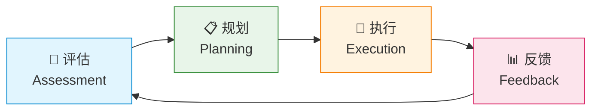
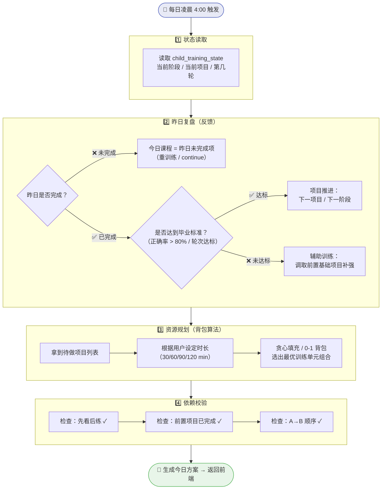
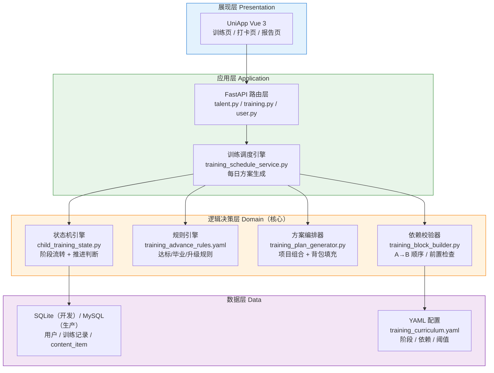
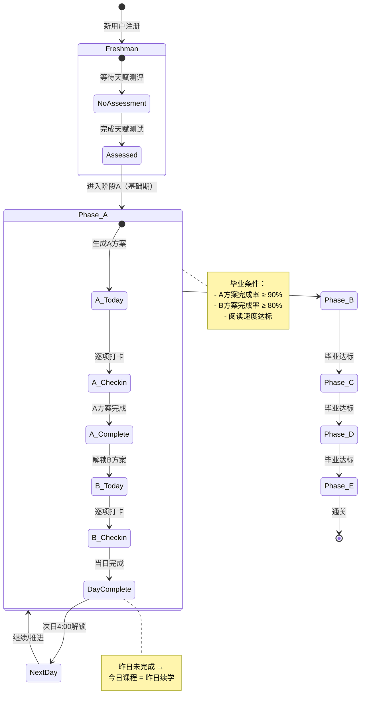
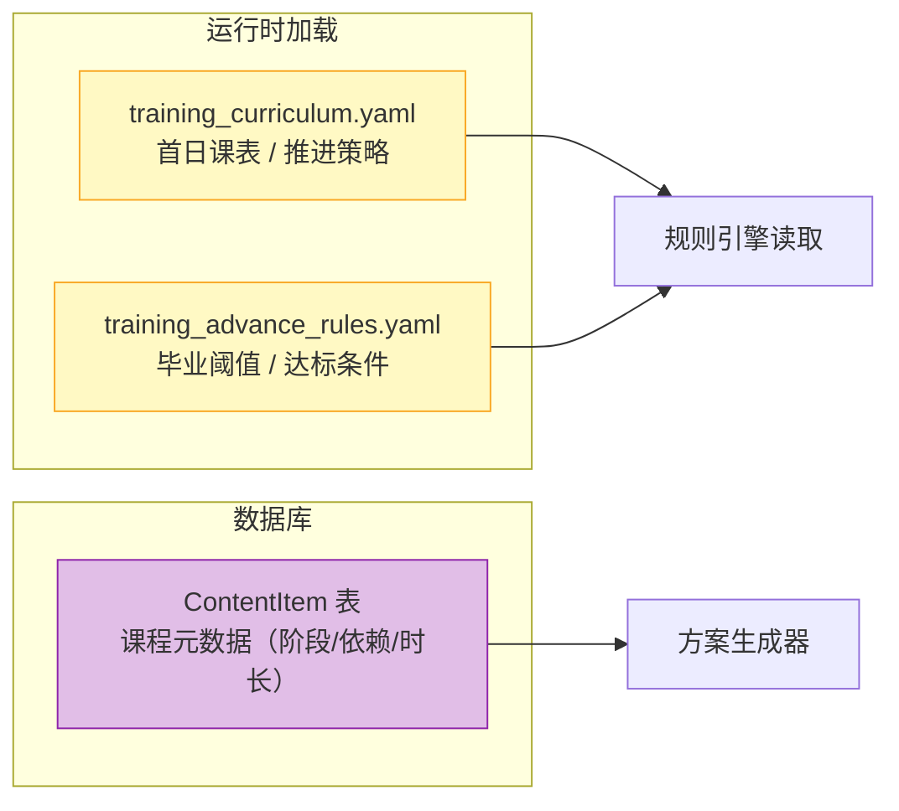
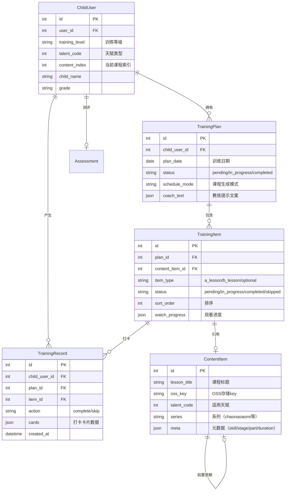
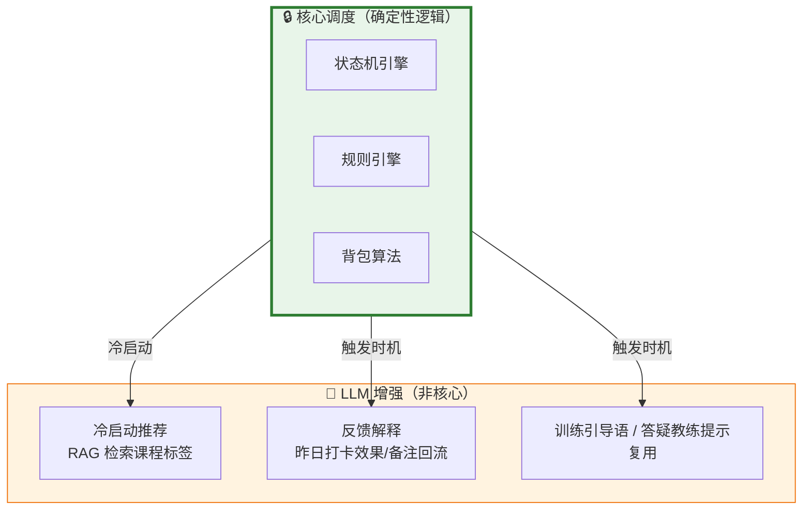
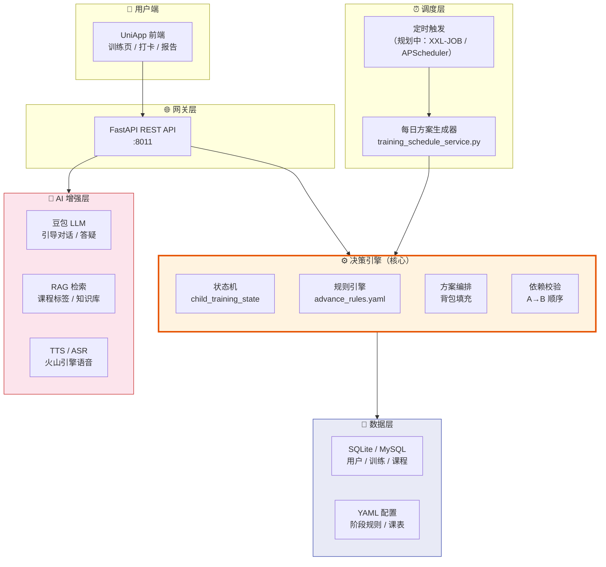

# 自适应训练系统 — 体系架构设计

> 创建日期：2026-06-29
> 版本：v1.0
> 基于：老板口述 + 现有代码实现抽象

---

## 一、核心业务模型

将训练系统拆解为 4 个核心概念，形成「评估→规划→执行→反馈」闭环：



| 概念 | 英文 | 职责 | 现有实现 |
|------|------|------|----------|
| **训练阶段** | Phase | 定义阶段 A~E，每个阶段有准入标准和毕业标准 | `training_curriculum.yaml` + `training_advance_rules.yaml` |
| **训练项目** | Task/Module | 阶段内的具体课程，有类型（超脑阅读/影像追忆/扫描速记…）、前置依赖、单轮时长 | `ContentItem` 表 + `content_meta.py` |
| **训练记录** | Record | 孩子昨日完成情况（完成度、用时、质量分） | `TrainingRecord` 表 + `TrainingItem` 表 |
| **全局约束** | Constraint | 今日可用时长、每日最大训练量、解锁时间（凌晨4点） | `TrainingWindow` + `training_day.py` |

---

## 二、闭环执行流程



### 关键规则

| 规则 | 说明 | 现有实现 |
|------|------|----------|
| **昨日未完 → 重训** | 昨日未打卡，今日延续同一课程 | `training_service.py: _continue_incomplete` |
| **达标 → 推进** | 项目完成且质量达标，进入下一个项目 | `training_advance_rules.yaml` + `training_mastery.py` |
| **未达标 → 补强** | 调取前置阶段基础项目做辅助训练 | `training_optional_service.py` |
| **A→B 顺序** | 必须先完成 A 方案所有项才能打卡 B | `training_block_builder.py` |
| **凌晨4点解锁** | 新的一天从凌晨4点算起 | `training_day.py` |

---

## 三、技术架构分层



| 层级 | 职责 | 技术选型 | 现有实现 |
|------|------|----------|----------|
| **展现层** | 训练页面、打卡交互、报告展示 | UniApp Vue 3 | `vue_fronted/src/pages/training/` |
| **应用层** | API 路由、请求校验、调度触发 | Python FastAPI | `app/api/training.py` |
| **逻辑决策层** | 状态流转、规则判断、方案编排（**核心**） | Python 服务层 | `app/services/training_*.py` |
| **数据层** | 持久化、配置管理 | SQLite / MySQL + YAML | `app/db/models.py` + `backend/config/*.yaml` |

---

## 四、状态机设计



---

## 五、动态配置中心

> **核心原则：阶段标准、依赖关系、训练内容不写在代码里，运营可实时调整。**

### 配置层次



### 关键配置示例

**阶段毕业规则** (`training_advance_rules.yaml`)：
```yaml
advance_rules:
  phase_A_to_B:
    conditions:
      - type: "completion_rate"
        threshold: 0.9
        scope: "a_lessons"
      - type: "completion_rate"
        threshold: 0.8
        scope: "b_lessons"
      - type: "reading_speed"
        threshold: 800
        unit: "字/分钟"
    on_pass: "advance_to_phase_B"
    on_fail: "supplement_phase_A_basics"
```

**首日课表** (`training_curriculum.yaml`)：
```yaml
day_one:
  a_lessons:
    - skill: "超脑阅读"
      stage: 1
      part: 1
  b_lessons: []

after_day_one:
  strategy: "random"  # 次日开始随机选课
```

---

## 六、关键数据结构

### 现有核心表



### 规划中的配置（未立项，勿按已实现开发）

以下仅为架构讨论记录，**当前版本不实施**：

- 阶段定义表 `phase_definition`（规则仍在 YAML）
- 运营后台实时改阈值
- Redis 方案缓存

详见 [数据闭环与预留说明.md](数据闭环与预留说明.md)。

---

## 七、LLM / Agent / RAG 定位



> **原则：核心调度不走 LLM。** 状态流转、进度推进、课程排序交给确定性规则引擎。LLM 用于文案、答疑辅导与昨日反馈解释；昨日 `result/note` 与答疑 `mistake_pattern` 已接入（见 [数据闭环与预留说明.md](数据闭环与预留说明.md)）。

---

## 八、架构全景图



---

## 九、与现有实现的映射

| 架构概念 | 现有实现 | 状态 |
|----------|----------|------|
| 状态机引擎 | `child_training_state.py` | ✅ 已实现 |
| 规则引擎 | `training_advance_rules.yaml` | ✅ 已实现 |
| 方案编排器 | `training_plan_generator.py` + `training_schedule_service.py` | ✅ 已实现 |
| 依赖校验 | `training_block_builder.py` → A/B 顺序 | ✅ 已实现 |
| 背包填充 | `training_duration_pack.py` → 按时长选课 | ✅ 已实现 |
| 日切逻辑 | `training_day.py` → 凌晨4点解锁 | ✅ 已实现 |
| 课表路由 | `training_curriculum.py` + `training_curriculum_router.py` | ✅ 已实现 |
| 内容池 | `talent_content_pool.py` → 按天赋筛选 | ✅ 已实现 |
| 教练文案 | `training_child_guide.py` → LLM 生成 | ✅ 已实现 |
| 昨日反馈回流 | `get_yesterday_training_context()` 含 result/note | ✅ 已实现 |
| 答疑教练复用 | `qa_coach.fetch_recent_coach_context_for_prompt` | ✅ 已实现 |
| 定时调度 | `training_curriculum_scheduler.py` → 按需生成 | ✅ 已实现 |
