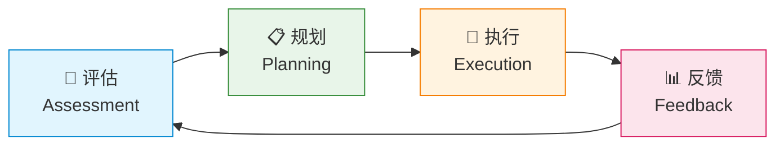
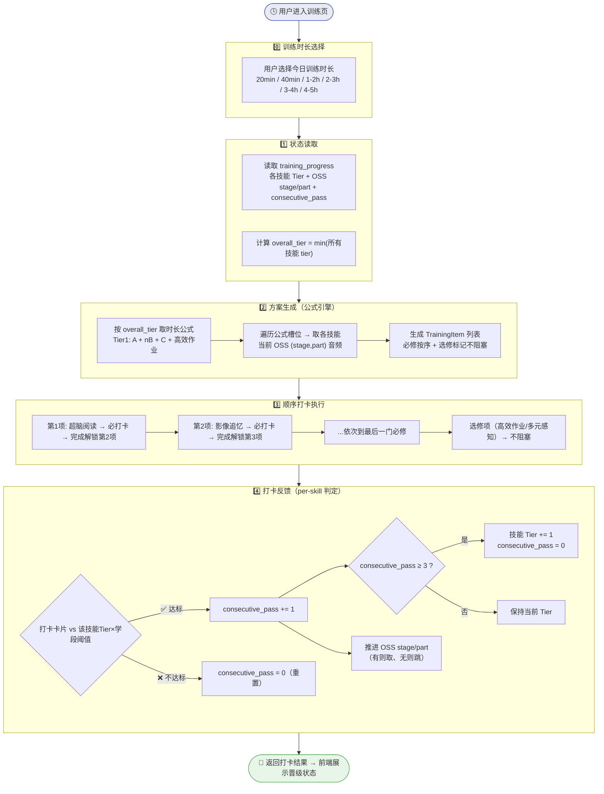
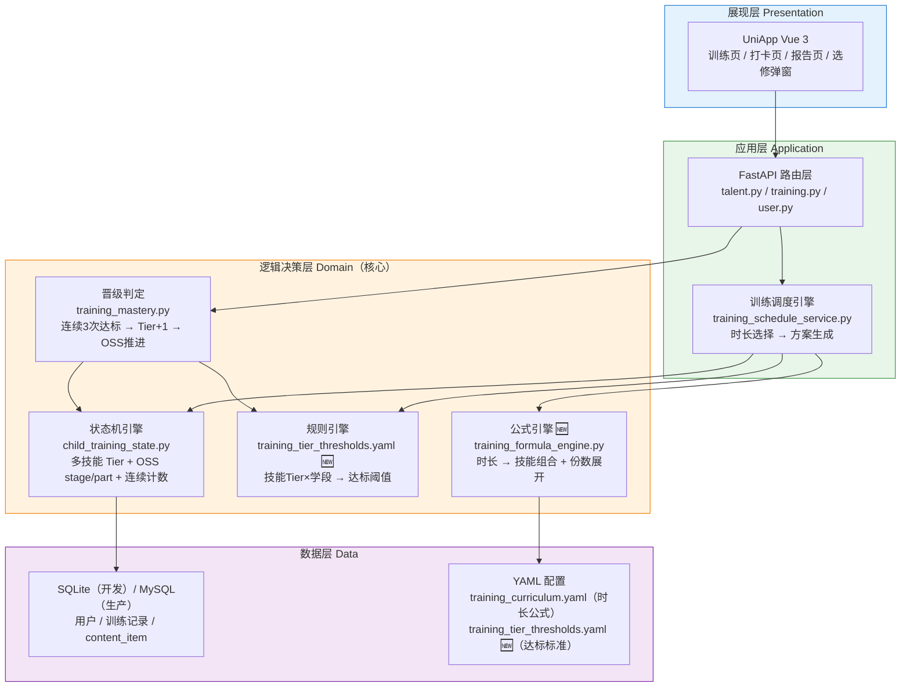
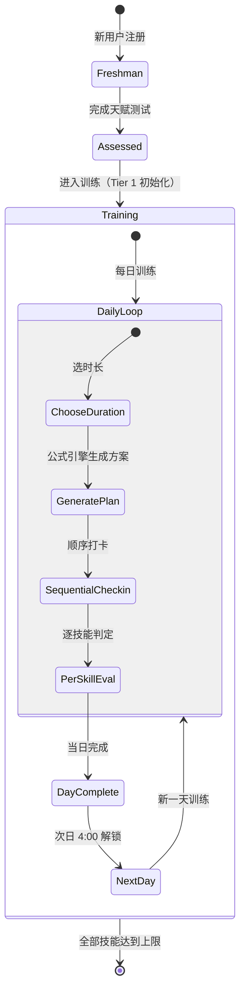
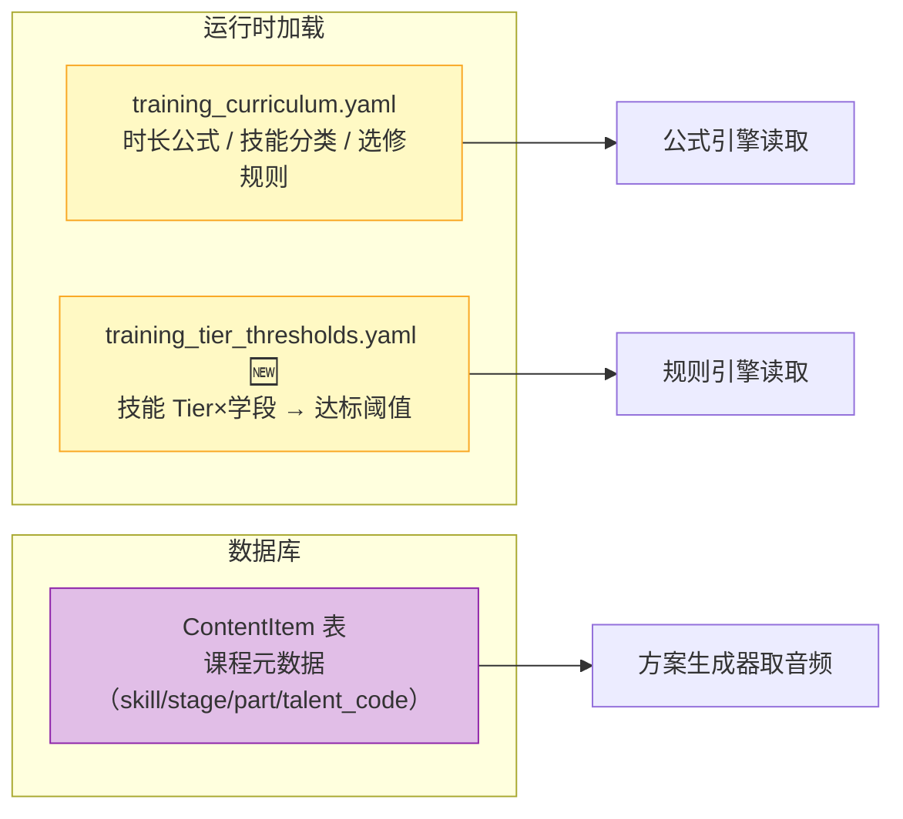
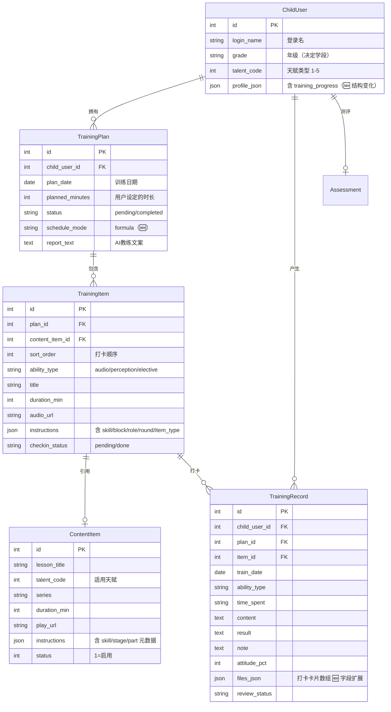
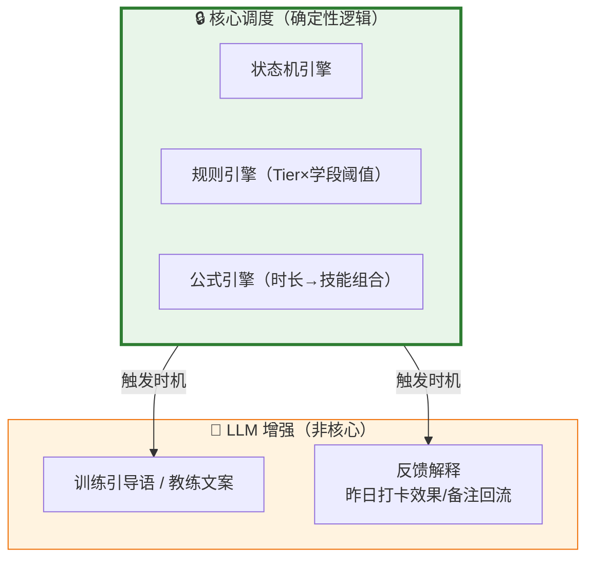
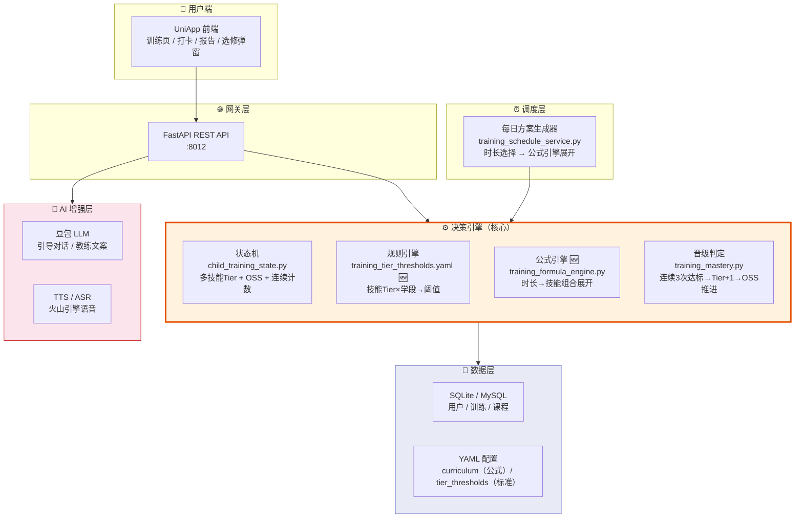

# 自适应训练系统 — 体系架构设计

> 创建日期：2026-06-29
> 最后更新：2026-07-02
> 版本：v2.0
> 变更：从"主线 Phase A→E"重构为"多技能并行 Tier 独立晋级"模型
> 依据：[标准流程理解文档.md](标准流程理解文档.md) + OSS 音频实际数据

---

## 一、核心业务模型

将训练系统拆解为 4 个核心概念，形成「评估→规划→执行→反馈」闭环：



| 概念 | 英文 | 职责 | 实现 |
|------|------|------|------|
| **训练阶位** | Skill Tier | 每个技能独立 Tier 1-N，决定达标标准；`overall_tier = min(所有技能 tier)` | `training_curriculum.yaml` (tier_thresholds) |
| **训练项目** | Task/Module | 每日训练项，由时长公式 + 当前 OSS stage/part 决定内容 | `ContentItem` 表 + `content_meta.py` |
| **训练记录** | Record | 打卡卡片数据（用时、字数、准确度等），驱动晋级判定 | `TrainingRecord` 表 |
| **全局约束** | Constraint | 每日可用时长、顺序打卡锁、4:00 日切、选修弹窗规则 | `TrainingWindow` + `training_day.py` |

### 三条推进线（互不等待）

```
┌──────────────────┐  ┌──────────────────────┐  ┌────────────────────┐
│  线1：每日训练安排  │  │  线2：技能 Tier 独立晋级│  │  线3：整体 Tier      │
│  时长公式 a+nb+c  │  │  连续3次达标 → Tier+1  │  │  min(所有技能 Tier)  │
│  暂统一用Tier1公式 │  │  各走各的互不等待       │  │  = 最低原则          │
└──────────────────┘  └──────────────────────┘  └────────────────────┘
```

---

## 二、闭环执行流程



### 关键规则

| 规则 | 说明 | 实现 |
|------|------|------|
| **顺序打卡** | 必修技能严格按公式顺序，前一项打卡完成 → 解锁下一项 | 公式引擎输出有序列表 |
| **连续3次达标 → 晋级** | 同一技能连续3次打卡达标，该技能 Tier+1；不达标重置计数 | `training_mastery.py` |
| **OSS 存量推进** | 连续3次达标 → 推进 OSS (stage,part)，找下一个可用音频；耗尽则该技能 OSS 终止 | `child_training_state.py` |
| **最低原则** | `overall_tier = min(所有活跃技能 tier)`，确保落后技能不被跳过 | `child_training_state.py` |
| **训练先行、考核滞后** | 扫描速记 Tier 1 就开始练，Tier 2 才纳入晋级考核 | 时长公式 + tier_thresholds 配置 |
| **选修不阻塞** | 高效作业/多元感知/精力恢复不阻塞后续训练项 | 前端 + `item_type` 标记 |
| **凌晨4点解锁** | 新的一天从凌晨4点算起 | `training_day.py` |
| **昨日未完 → 续推** | 昨日未打卡的训练项可延续到今日（按技能） | `training_carryover.py` |

---

## 三、技术架构分层



| 层级 | 职责 | 技术选型 | 关键文件 |
|------|------|----------|----------|
| **展现层** | 训练页面、打卡交互、选修弹窗、报告展示 | UniApp Vue 3 | `vue_fronted/src/pages/training/` |
| **应用层** | API 路由、请求校验、调度触发 | Python FastAPI | `app/api/training.py` |
| **逻辑决策层** | 状态流转、晋级判定、公式展开、规则匹配（**核心**） | Python 服务层 | `app/services/training_*.py` |
| **数据层** | 持久化、配置管理 | SQLite / MySQL + YAML | `app/db/models.py` + `backend/config/*.yaml` |

---

## 四、状态机设计

### 4.1 用户生命周期



### 4.2 单个技能 Tier 状态机（核心）

```
技能 X（如影像追忆）的独立状态流转：

  Tier 1 ───[连续3次达标]───→ Tier 2 ───[连续3次达标]───→ Tier 3 ───→ ...
    │                          │                          │
    │ 达标标准:                 │ 达标标准:                 │
    │  1500字/75%准确度         │  2000字/80%准确度         │
    │ OSS: stage=1, part=1     │ OSS: stage=2, part=1     │
    │                          │                          │
    └──[1次不达标]──→ 重置计数   └──[1次不达标]──→ 重置计数

每个 Tier 内：
  ┌──────────────────────────────────────────────┐
  │  consecutive_pass: 0 → 1 → 2 → 3 → Tier+1    │
  │  任何时候不达标 → consecutive_pass = 0（重置）  │
  └──────────────────────────────────────────────┘

OSS Stage 推进（独立于 Tier）：
  每次达标 → 查找下一个可用 (stage, part)
  → 找到 → 推进 OSS
  → 找不到 → OSS 耗尽，该技能不再推送音频
```

### 4.3 训练日结算（4:00）

```
每日凌晨 4:00:
  1. 标记昨日 plan 为 completed
  2. bump training_days += 1
  3. 如有未完成训练项 → 标记 carryover（次日续推）
  4. 不涉及 Tier 晋级（Tier 在打卡时实时判定）
```

---

## 五、动态配置中心

> **核心原则：技能 Tier 达标标准、时长公式、训练内容不写在代码里，运营可实时调整。**

### 5.1 配置层次



### 5.2 关键配置结构

**时长公式** (`training_curriculum.yaml` — 重构)：

```yaml
# 技能定义
skills:
  required: [超脑阅读, 影像追忆, 扫描速记, 极速运算, 极速学习]
  elective: [精力恢复, 多元感知, 高效作业]

# 选修技能行为
elective_rules:
  精力恢复:
    trigger: duration_gte_8h       # 训练时长≥8h触发
    has_checkin: false
    blocks_next: false
  多元感知:
    trigger: manual                # 用户主动触发
    has_checkin: true              # 可打卡
    blocks_next: false
  高效作业:
    trigger: formula_slot          # 时长公式中包含时展示
    has_checkin: false
    blocks_next: false

# 时长 → 技能公式（Tier 1，后续阶位可扩展）
duration_formula:
  - minutes: 20
    slots: [A]                     # A=超脑阅读
  - minutes: 40
    slots: [A, B]                  # B=影像追忆
  - minutes: [60, 120]
    primary_school: [A, B, C]      # C=扫描速记
    junior_high:    [A, B, C]
    junior_high_c_note: "不建议"    # 初高中C标记不建议
  - minutes: [121, 180]
    slots: [A, B, B, C, 高效作业]
    tier_replace:                  # ≥3阶替换
      "高效作业": "极速学习"
    note: "建议2套以上试卷"
  - minutes: [181, 240]
    slots: [A, B, B, C, 高效作业]
    tier_replace:
      "高效作业": "极速学习"        # ≥3阶时 x2
    note: "建议3套以上试卷"
  - minutes: [241, 300]
    slots: [A, B, B, B, C, 高效作业]
    tier_replace:
      "高效作业": "极速学习"        # ≥3阶时 x3
    note: "建议4套以上试卷"

# 初高中 C 行为
grade_behavior:
  junior_high_c: not_recommended   # 展示但标注，用户可选
  senior_high_c: not_recommended

# 初高中极速运算可选修（Tier 3+）
optional_in_grades:
  极速运算: [junior, senior]
```

**Tier 达标标准** (`training_tier_thresholds.yaml` — 🆕新建)：

```yaml
# 技能 × Tier × 学段 → 达标阈值
# 每次打卡时根据：技能名 + 技能当前 Tier + 用户学段 → 查表判定

tier_thresholds:
  超脑阅读:
    1:
      primary_low:   { type: wpm, words: 800,  minutes: 3 }
      primary_high:  { type: wpm, words: 1000, minutes: 3 }
      junior:        { type: wpm, words: 1800, minutes: 3 }
      senior:        { type: wpm, words: 2000, minutes: 3 }
    2:
      primary_low:   { type: wpm, words: 2000, minutes: 5 }
      primary_high:  { type: wpm, words: 2500, minutes: 5 }
      junior:        { type: wpm, words: 4000, minutes: 5 }
      senior:        { type: wpm, words: 5000, minutes: 5 }
    # Tier 3+ 无超脑阅读晋级要求

  影像追忆:
    1:
      primary_low:   { type: recall, words: 1500, accuracy_pct: 75 }
      primary_high:  { type: recall, words: 3000, accuracy_pct: 75, minutes: 4 }
      junior:        { type: recall, words: 5000, accuracy_pct: 80, minutes: 5 }
      senior:        { type: recall, words: 6000, accuracy_pct: 80, minutes: 6 }
    2:
      primary_low:   { type: recall, words: 2000, accuracy_pct: 80, minutes: 5 }
      primary_high:  { type: recall, words: 3500, accuracy_pct: 80, minutes: 5 }
      junior:        { type: recall, words: 6000, accuracy_pct: 85, minutes: 6 }
      senior:        { type: recall, words: 7000, accuracy_pct: 85, minutes: 8 }
    # Tier 3-5 待量化补充

  扫描速记:
    1:
      # Tier 1 扫描速记练但不考（训练先行、考核滞后）
      all: null
    2:
      primary_low:   { type: memory, words_per_min: 80,  reverse_recite: true }
      primary_high:  { type: memory, words_per_min: 100, reverse_recite: true }
      junior:        { type: memory, words_per_min: 80,  reverse_recite: true }
      senior:        { type: memory, words_per_min: 60,  reverse_recite: true }
    # Tier 3+ 待补充

  极速运算:
    1:
      # Tier 1 不出现
      all: null
    2:
      # Tier 2 不出现
      all: null
    3:
      primary_low:   { type: speed_calc, digits: "5×5" }
      primary_high:  { type: speed_calc, digits: "5×5" }
      junior:        { type: speed_calc, digits: "4×4", optional: true }
      senior:        { type: speed_calc, digits: "3×3", optional: true }

  极速学习:
    4:
      # 四阶才出现，量化待补充
      all: { type: program, name: "火箭提分营", days: 5 }

  高效作业:
    # 不打卡，无达标判定
    all: null

# 晋级规则
advance_rule:
  consecutive_pass: 3              # 连续3次达标→Tier+1
  reset_on_fail: true              # 不达标重置计数
  per_skill_independent: true      # 各技能独立判定

# OSS 推进规则
oss_advance:
  mode: next_available             # 按 OSS 存量取下一阶段
  on_exhausted: stop_audio         # 耗尽后停止推送音频
  tier_oss_independent: true       # Tier 和 OSS 不绑定
```

### 5.3 扫描速记"逐字倒背"的宽容策略

```yaml
scan_memory_tolerance:
  reverse_recite_check: sample     # 抽查即可，不过度严格
  strict_mode: false               # 避免增加畏难情绪
  note: "抽查即可，不要求每字严格验证"
```

---

## 六、关键数据结构

### 6.1 数据库表（保留，微调字段含义）



### 6.2 training_progress JSON 结构（🆕 完全重构）

```python
# child_user.profile_json.training_progress
{
    "overall_tier": 1,               # 🆕 min(所有技能 tier)，决定排课公式
    "skills": {
        "超脑阅读": {
            "tier": 1,               # 🆕 技能独立 Tier
            "oss_stage": 0,          # OSS 当前 stage（0=无阶段单音频）
            "oss_part": 0,
            "consecutive_pass": 0    # 🆕 连续达标计数
        },
        "影像追忆": {
            "tier": 1,
            "oss_stage": 1,
            "oss_part": 1,
            "consecutive_pass": 0
        },
        "扫描速记": {
            "tier": 1,
            "oss_stage": 1,
            "oss_part": 1,
            "consecutive_pass": 0
        },
        "极速运算": {
            "tier": 1,
            "oss_stage": 2,          # 🆕 起点因天赋而异：学者=2, 行者/德者无此技能特殊处理
            "oss_part": 1,
            "consecutive_pass": 0
        },
        "极速学习": {
            "tier": 1,
            "oss_stage": 2,          # 🆕 学者=2, 行者=3, 德者=3
            "oss_part": 1,
            "consecutive_pass": 0
        }
    },
    "training_days": 0,
    "training_day_anchor": "2026-07-02",
    "last_settled_plan_date": None
}
```

### 6.3 打卡卡片字段（`files_json` — 🆕 字段扩展）

```python
# 不同类型的技能打卡卡片字段不同：

超脑阅读卡片:
  { name: "超脑阅读", time: "3", wordCount: "800" }
  # 判定: wordCount / time ≥ 阈值 wpm

影像追忆卡片:
  { name: "影像追忆", time: "4", wordCount: "1500", accuracy: "75" }
  # 判定: wordCount ≥ 阈值 + accuracy ≥ 阈值

扫描速记卡片:
  { name: "扫描速记", wordCount: "80", time: "1", reverseRecite: true }
  # 判定: wordCount/time ≥ 阈值 + reverseRecite == true

极速运算卡片:
  { name: "极速运算", digits: "5×5", correctCount: "8", totalCount: "10" }
  # 判定: correctCount/totalCount ≥ 70% 或完成/未完成
```

---

## 七、LLM / Agent / RAG 定位



> **原则：核心调度不走 LLM。** Tier 晋级、OSS 推进、公式展开交给确定性规则引擎。LLM 仅用于教练文案和反馈解释。

---

## 八、架构全景图



---

## 九、与实现的映射（v2.0 改造后）

| 架构概念 | 文件 | v2.0 状态 |
|----------|------|:--:|
| **状态机引擎** | `child_training_state.py` | 🔴 重写：多技能 Tier + OSS + 连续计数 |
| **规则引擎** | `training_tier_thresholds.yaml` | 🆕 新建：技能Tier×学段→达标阈值 |
| **公式引擎** | `training_formula_engine.py` | 🆕 新建：时长→技能组合展开 |
| **晋级判定** | `training_mastery.py` | 🔴 重写：连续3次达标→Tier+1→OSS推进 |
| **方案编排** | `training_schedule_service.py` | 🔴 重写：调用公式引擎+OSS取音频 |
| **顺序打卡** | `training_service.py` (checkin) | 🟡 改：适配新state结构+连续计数 |
| **日切逻辑** | `training_day.py` | 🟢 保留：4:00日切逻辑不变 |
| **日结算** | `training_day_settlement.py` | 🟡 改：去掉pending_main_line逻辑 |
| **续推** | `training_carryover.py` | 🟡 改：按技能续推 |
| **内容池** | `talent_content_pool.py` | 🟢 保留：按天赋查OSS池不变 |
| **元数据解析** | `content_meta.py` | 🟢 保留：stage/part解析不变 |
| **教练文案** | `training_child_guide.py` | 🟢 保留：LLM生成文案不变 |
| **选修管理** | `training_elective_service.py` | 🆕 新建：选修弹窗+不阻塞逻辑 |
| **时长公式配置** | `training_curriculum.yaml` | 🔴 重写：main_lines→duration_formula+elective_rules |
| **达标标准配置** | `training_tier_thresholds.yaml` | 🆕 新建 |

| 符号 | 含义 |
|:--:|------|
| 🟢 | 基本复用 |
| 🟡 | 部分修改 |
| 🔴 | 重写/重构 |
| 🆕 | 新建文件 |

### 废弃文件（v2.0 不再使用）

| 文件 | 原因 |
|------|------|
| `training_block_builder.py` | 训练块概念废弃，由公式引擎替代 |
| `training_duration_pack.py` | 背包填充废弃，由公式引擎替代 |
| `training_curriculum_router.py` | 主线路由废弃 |
| `training_curriculum_scheduler.py` | 课程调度合并到 schedule_service |
| `training_route_llm.py` | LLM 路由不再用于核心排课 |
| `training_route_context.py` | LLM 路由上下文废弃 |
| `training_optional_service.py` | 替换为 `training_elective_service.py` |
| `training_advance_rules.yaml` | 替换为 `training_tier_thresholds.yaml` |

---

## 十、版本范围

| 功能 | v2.0 范围 | 说明 |
|------|:--:|------|
| Tier 1 训练公式 | ✅ | 六档时长（20min/40min/1-2h/2-3h/3-4h/4-5h） |
| Tier 1 晋级标准 | ✅ | 超脑阅读/影像追忆（按学段量化） |
| 连续3次达标→晋级 | ✅ | 各技能独立判定 |
| 最低原则算overall_tier | ✅ | |
| OSS stage/part推进 | ✅ | 按存量，与Tier独立 |
| 选修弹窗 | ✅ | 精力恢复/多元感知/高效作业 |
| 顺序打卡+不阻塞选修 | ✅ | |
| Tier 2+ 训练公式 | 🔒 | 暂用Tier1公式，等老板补充 |
| Tier 2+ 晋级标准 | 🔒 | 部分已量化，部分待补充 |
| Tier 6-9 | 🔒 | 不纳入当前版本 |
