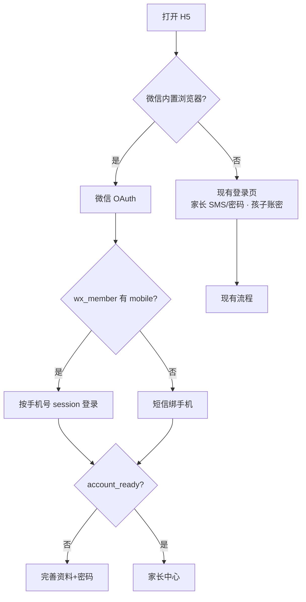

# 微信与家长登录方案

> 版本：2026-07-07  
> 状态：**开发中**（后端骨架 + 前端微信入口已接入，待配置微信/公司短信后联调）

---

## 1. 目标

| 目标 | 说明 |
|------|------|
| 微信内家长快捷登录 | 认证服务号 H5 → OAuth 拿 openid → 匹配老会员 → 直接进或绑手机 |
| 非微信入口不变 | 现有家长 SMS/密码注册登录、孩子账密登录 **不改动行为** |
| 孩子多设备 | 每台设备**首次**账密登录；同设备 session 有效则直接进 |
| 账号统一 | 家长以 **手机号** 为唯一键；密码保证全入口可登录 |
| 微信资料门禁 | 微信进来的家长须 **绑手机（若缺）+ 补资料 + 设密码** 后才能添加孩子 |

---

## 2. 两条通道（严格区分）



| 通道 | 身份键 | 使用的表 | openid |
|------|--------|----------|--------|
| **微信家长** | openid → mobile → parent_id | `wx_member_snapshot`、`parent_wechat_bind`、`child_user` | ✅ |
| **非微信家长/孩子** | mobile / login_name | `child_user` 等 | ❌ 不涉及 |

---

## 3. 孩子登录（多设备）

| 时机 | 行为 |
|------|------|
| 某设备**第一次** | 必须 **孩子账号 + 密码** |
| 同一设备再次打开 | `session_token` 有效 → **直接进**（现有 `UserSession`） |
| 新设备 / 退出后 | 再次账密登录 |
| 微信 | **不单独做孩子微信登录**；孩子从任意设备账密首登 |

---

## 4. 微信家长状态机

| 状态 | 条件 | 用户看到 |
|------|------|----------|
| S0 | 无 session | OAuth |
| S1 | 有 session，未绑手机 | 绑手机 + 验证码 |
| S2 | 已绑手机，`account_ready=false` | 完善资料（**密码必填**） |
| S3 | `account_ready=true` | 家长中心、添加孩子 |

**`account_ready`（仅微信渠道 `login_channel=wechat`）**

```text
phone_verified + nickname + real_name + password_hash
```

非微信家长仍用原有 `profile_complete`（姓名+昵称，密码可选）。

未完成 S2/S3 时：点击「添加孩子」、进入家长中心功能 → **强制回** `/pages/login/complete-parent?from=wechat`。

---

## 5. 数据库

### 5.1 Jnao 主库 `jnao_daka`

**`wx_member_snapshot`** — 从 `db_fz_jingnao.ys_wx_member` 同步的镜像（只在本库读写）

| 字段 | 说明 |
|------|------|
| wx_member_id | 老表 id |
| openid / unionid | 微信标识 |
| mobile | 手机号 |
| nickname / truename | 展示名 |
| synced_at | 同步时间 |

**`parent_wechat_bind`** — openid 与 Jnao 家长绑定

| 字段 | 说明 |
|------|------|
| parent_id | `child_user.id`（role=parent） |
| openid / unionid / app_id | 微信 |
| wx_member_id | 可选，排查用 |

**`child_user.profile_json.parent` 扩展**

| 字段 | 说明 |
|------|------|
| `login_channel` | `wechat` \| `standard` |
| `phone_verified_at` | 手机验证时间 |
| `real_name` | 真实姓名 |

### 5.2 老库（只读）`db_fz_jingnao`

- 表：`ys_wx_member`
- Jnao **不写** 老库；同步脚本 / 首次查询时写入 snapshot

---

## 6. 已实现 / 计划 API

### 6.1 微信认证（Jnao 后端）

| 方法 | 路径 | 说明 | 状态 |
|------|------|------|------|
| GET | `/api/auth/wechat/config` | 是否已配置微信、是否微信 UA 建议走 OAuth | ✅ |
| GET | `/api/auth/wechat/oauth-url` | 生成 OAuth URL（含 state） | ✅ |
| GET | `/api/auth/wechat/callback` | code 换 openid，302 回前端 | ✅ 待配 AppSecret |
| POST | `/api/auth/wechat/bind-phone` | `{ bind_ticket, phone, sms_code }` 绑手机并登录 | ✅ |
| POST | `/api/auth/wechat/send-bind-sms` | `{ bind_ticket, phone }` 发绑手机验证码 | ✅ |

**回调成功后 302 到前端：**

```text
{SITE_DOMAIN}/pages/login/index?wx=1&session_token=...&user_id=...&next_step=complete-profile|bind-phone|home
```

### 6.2 现有 API（不变）

| 路径 | 说明 |
|------|------|
| `POST /api/auth/login` | 家长密码 / 孩子账密 |
| `POST /api/auth/sms/*` | 非微信家长 SMS |
| `GET/PUT /api/parent/profile` | 资料；响应增加 `account_ready`、`login_channel`、`next_step` |
| `POST /api/parent/children` | 微信家长 `account_ready=false` 时 **403** |

### 6.3 需公司提供的 API（短信走已有服务）

Jnao 通过 HTTP 代理调用，**不强制直连阿里云**。

| 需提供 | 说明 |
|--------|------|
| `POST {COMPANY_SMS_BASE_URL}/send` |  body: `{ phone, scene, code? }` 或由公司生成码 |
| `POST {COMPANY_SMS_BASE_URL}/verify` | 可选；若不提供则仍用 Jnao Redis 存码 + 公司只负责发送 |

**环境变量见第 8 节。** 未配置时开发环境可继续 `SMS_PROVIDER=mock`。

### 6.4 运维脚本

| 脚本 | 说明 |
|------|------|
| `scripts/sync_wx_member_snapshot.py` | 从 `db_fz_jingnao.ys_wx_member` 增量同步到 snapshot |

```bash
python scripts/sync_wx_member_snapshot.py
# 或指定 LEGACY_DATABASE_URL
```

---

## 7. 前端页面

| 页面 | 作用 |
|------|------|
| `pages/login/index` | 非微信照常；微信内 `from=mp` 自动 OAuth；处理 `?wx=1` 回调 |
| `pages/login/bind-phone` | 微信缺手机号时绑手机 |
| `pages/login/complete-parent` | 微信：`from=wechat` 时密码**必填**、不可跳过 |
| `pages/parent/index` | 进入前检查 `account_ready`，未就绪跳转完善页 |

---

## 8. 环境变量清单

### 8.1 数据库（同一 RDS 实例）

```env
DATABASE_URL=mysql+pymysql://用户:密码@主机:3306/jnao_daka
LEGACY_DATABASE_URL=mysql+pymysql://用户:密码@主机:3306/db_fz_jingnao
```

### 8.2 微信服务号（**待你提供**）

```env
WECHAT_MP_APP_ID=wx.....................
WECHAT_MP_APP_SECRET=.....................
WECHAT_OAUTH_REDIRECT_URI=https://jnaosoft.cn/api/auth/wechat/callback
SITE_DOMAIN=https://jnaosoft.cn
```

**公众号后台操作：**

1. 开发 → 基本配置 → 记录 AppID / AppSecret  
2. 设置与开发 → 公众号设置 → 功能设置 → **网页授权域名**：`jnaosoft.cn`  
3. 自定义菜单链接：`https://jnaosoft.cn/pages/login/index?from=mp`

### 8.3 短信（**待公司提供接口或阿里云参数**）

**方案 A — 公司 HTTP 代理（推荐）**

```env
SMS_PROVIDER=company
COMPANY_SMS_BASE_URL=https://公司域名/api/sms
COMPANY_SMS_API_KEY=...
COMPANY_SMS_SEND_PATH=/send
```

**方案 B — Jnao 直连阿里云**

```env
SMS_PROVIDER=aliyun
ALIYUN_SMS_ACCESS_KEY_ID=...
ALIYUN_SMS_ACCESS_KEY_SECRET=...
ALIYUN_SMS_SIGN_NAME=...
ALIYUN_SMS_TEMPLATE_CODE=SMS_......
```

**方案 C — 本地/内测**

```env
SMS_PROVIDER=mock
SMS_MOCK_CODE=88888
JNAO_ENV=development
```

### 8.4 Redis（已有）

```env
REDIS_URL=redis://:密码@host:6379/0
```

用于 OAuth state、bind_ticket、短信验证码。

---

## 9. 你需要提供的清单（联调前）

| # | 项 | 提供方式 |
|---|-----|----------|
| 1 | 微信 AppID + AppSecret | 写入服务器 `.env.production` 或私发 |
| 2 | 确认网页授权域名已配 `jnaosoft.cn` | 回复「已配置」 |
| 3 | `LEGACY_DATABASE_URL` 能 SELECT `ys_wx_member` | 与 `DATABASE_URL` 同实例仅改库名 |
| 4 | 公司短信 API 文档或阿里云签名+模板 | 接口 URL + 鉴权方式 |
| 5 | 测试 openid 两条（有 mobile / 无 mobile） | 可选，便于验收 |
| 6 | 执行一次 snapshot 同步 | `python scripts/sync_wx_member_snapshot.py` |

---

## 10. 开发阶段说明

| 阶段 | 内容 | 依赖 |
|------|------|------|
| **Phase 1** ✅ 进行中 | 表结构、profile/account_ready、微信 API 骨架、前端页面与守卫 | 无 |
| **Phase 2** | 配置 AppSecret 后 OAuth 联调 | #1 #2 |
| **Phase 3** | 公司短信 / 阿里云短信联调 | #4 |
| **Phase 4** | 生产 snapshot 定时同步、公众号菜单 | #3 #6 |
| **Phase 5** | 小程序（UnionID 共用 bind 表） | 后续 |

---

## 11. 安全要点

- openid **仅**服务端用 code 换取，前端不可伪造  
- `ys_wx_member` / 老库 **只读**  
- 微信绑手机 scene=`bind`，与 register/login 分开限流  
- 生产环境禁止 `SMS_PROVIDER=mock`（现有启动校验）  
- 家长改密后 `revoke_all_sessions`（现有逻辑）

---

## 12. 相关文件

| 路径 | 说明 |
|------|------|
| `backend/app/services/wechat_auth_service.py` | OAuth、snapshot、绑定 |
| `backend/app/services/parent_profile_service.py` | account_ready |
| `backend/app/api/auth.py` | 微信路由 |
| `backend/migrations/012_wechat_auth.sql` | 表结构 |
| `scripts/sync_wx_member_snapshot.py` | 老库同步 |
| `vue_fronted/src/pages/login/bind-phone.vue` | 绑手机 |
| `vue_fronted/src/utils/wechatAuth.js` | 微信 UA、OAuth 跳转 |
